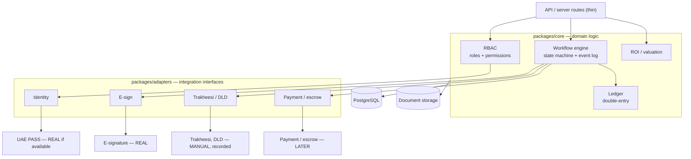

# Markaz Home — Core Components & RBAC

**Status:** Living document · Design set (C4 Level 3) + foundation spec
**Purpose:** open the core-domain box into its parts and the adapter layer, and define access control as a matrix before auth is built.

---

## 1. Component view (C4 Level 3)

Inside the application: the API is thin, the domain logic lives in `core`, and **every external system is reached only through an adapter interface**. Adapters wrap a real, a manual-and-recorded, or a later implementation, so the pilot runs without the licensed integrations and flips them on later with no rewrite.

**Reading it:** the workflow engine orchestrates a deal and is the only thing that reaches outward, always through an adapter, never calling an external service directly. The ledger, RBAC, and ROI logic are sibling domain services. The labels on the right (REAL / MANUAL / LATER) are the integration status from Round 1 Q9: e-signature is live, identity is live if UAE PASS access is available, the licensed government systems are manual-and-recorded behind their adapter, and payment/escrow is a later, licence-gated addition. Swapping a manual adapter for a real one is a single implementation change behind a stable interface.

---

## 2. RBAC permission matrix

The key idea first: **"User" is not Buyer-or-Seller.** Any authenticated person is a `User`; their buyer and seller abilities are scoped to *their own* listings, offers, and deals through ownership checks. This is design rule 5 (identity separate from role) in practice, the same person can be a buyer on one property and a seller on another without a role change. The named roles below are the cross-cutting internal ones.

| Action | User (own) | Operations | Compliance | Support | Admin |
|---|---|---|---|---|---|
| Browse / search public listings | ✓ | ✓ | ✓ | ✓ | ✓ |
| Create & manage a listing | ✓ own | assist | — | — | ✓ |
| Upload documents to own listing / deal | ✓ own | ✓ | — | — | ✓ |
| Make an offer | ✓ | — | — | — | ✓ |
| Accept / reject offers on own listing | ✓ own | assist | — | — | ✓ |
| View a transaction | ✓ own deals | ✓ all | ✓ all | ✓ all (no PII) | ✓ |
| View sensitive docs (Title Deed, Emirates ID, KYC) | ✓ own uploads | ✓ | ✓ | — | ✓ |
| Advance transaction / verify deposit & docs / complete | — | ✓ | — | — | ✓ |
| Record ownership validation & Trakheesi permit | — | ✓ | ✓ | — | ✓ |
| KYC / compliance review & approval | — | — | ✓ | — | ✓ |
| View revenue & operations dashboard | — | ✓ | ✓ read | — | ✓ |
| Manage users & roles | — | — | — | — | ✓ |

**Notes:**
- **Buyers never see the other party's sensitive documents** — enforced by the "own uploads only" scoping on the sensitive-docs row. This is a hard rule.
- **Support has no PII access** by design — it can assist on transactions and listings but not open identity documents.
- The **Agent** role (viewings, promoted listings) arrives with Premium Managed, which is deferred, so it is not in this pilot matrix.

**How it's enforced (two layers):**
1. **Role guards** — does this user's role permit this *type* of action at all? (e.g. only Operations/Admin can verify a deposit.)
2. **Ownership scoping** — for "own" actions, is this actually the user's resource? (e.g. a seller can only accept offers on their own listing.)

Both layers are required. A role guard alone would let any seller act on any listing; an ownership check alone would let a buyer verify a deposit. The combination is real RBAC, not the single-flag check the reference repo used.
