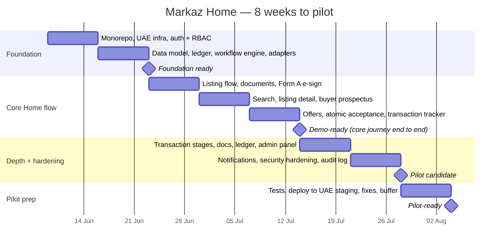

# Markaz Home — Build Roadmap to Pilot

**Goal:** a pilot-ready Markaz Home in roughly **8 weeks** (target end of July 2026). The client-facing commitment is **8–12 weeks** to leave buffer.
**Approach:** built fresh, foundation first, then the Home journey, with every external system behind an adapter. One engineer at ~20–25 hrs/week. English only for the pilot.

---

## Timeline

---

## What each phase delivers

### Weeks 1–2 · Foundation → *Milestone: Foundation ready*
The groundwork that makes everything after it fast, and keeps Home ready for Invest later.
- Fresh monorepo (web, admin, mobile-later apps; core, db, types, adapters packages), strict TypeScript, linting, CI.
- Infrastructure in a **UAE region**: PostgreSQL and encrypted document storage; self-hosted auth with **real role-based access control**.
- The **property-first data model** with ownership as a relationship (supports joint ownership now and entities/SPVs later).
- The **double-entry ledger** and the **configurable workflow engine** as reusable foundations.
- **Adapter interfaces** for every external system (e-signature, identity, Trakheesi, DLD, payment).

### Weeks 3–5 · Core Home flow → *Milestone: Demo-ready*
The end-to-end journey a seller and buyer actually experience.
- **Week 3:** sellers list one or more properties, upload access-controlled documents, and sign Form A through the real e-signature integration. *(MKZ-H-001)*
- **Week 4:** buyers search and filter listings, open detail pages with investment data, and see the **buyer prospectus**, standard on every listing. *(MKZ-H-003, H-006)*
- **Week 5:** buyers make offers; sellers accept; acceptance **atomically** creates the tracked transaction and the progress tracker goes live. *(MKZ-H-004, H-005)*
- At this point the full journey is demonstrable, with the licensed government steps shown as they will work on go-live.

### Weeks 6–7 · Depth + hardening → *Milestone: Pilot candidate*
- **Week 6:** the transaction moves through its stages (deposit, NOC, transfer, handover) recorded behind adapters; per-stage documents; the ledger recording the 1% commission and movements; the **admin / operations panel** (pipeline + verifications). *(MKZ-H-005, H-007)*
- **Week 7:** email notifications; a full **security pass** (every endpoint guarded, file-upload controls, rate limiting, audit logging); the revenue / operations dashboard. *(MKZ-H-007, H-008)*

### Week 8 · Pilot prep → *Milestone: Pilot-ready*
- Integration tests on the two spine flows, bug-fixing, a data-residency and security review, deployment to a UAE-region staging environment, and buffer.

---

## Assumptions
- One engineer at ~20–25 hrs/week; the foundation is built before features.
- Licensed government steps (Trakheesi, DLD) are manual and recorded for the pilot; e-signature and likely UAE PASS are integrated.
- English only; Arabic is a later phase.

## Risks & dependencies
- **The foundation is the main schedule risk.** Building it properly (data model, ledger, workflow engine) is what protects Invest later, but it compresses feature time if it overruns. The 8–12 week client-facing range absorbs this.
- **Two open decisions:** holding client money (research in progress) and integration prioritisation against the licensing timeline (call pending). Neither blocks the foundation; both shape the later integration work.
- Feature-level details are confirmed just-in-time as each feature is reached, rather than all up front.
