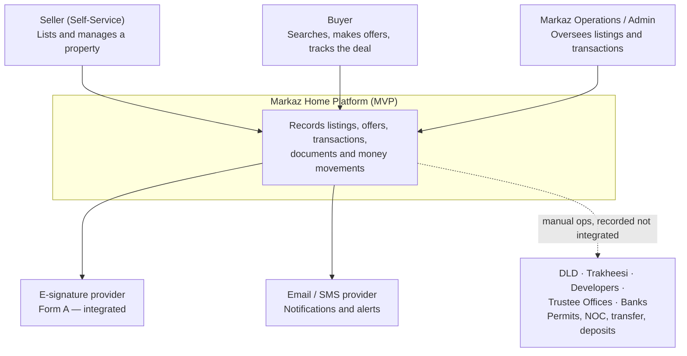

# C4 Level 1 — System context

Who uses Markaz Home and the external systems it touches. Government systems are manual/recorded for the pilot, not integrated.

```mermaid
flowchart TB
    seller["Seller (Self-Service)<br/>Lists and manages a property"]
    buyer["Buyer<br/>Searches, makes offers, tracks the deal"]
    ops["Markaz Operations / Admin<br/>Oversees listings and transactions"]

    subgraph markaz["Markaz Home Platform (MVP)"]
        platform["Records listings, offers, transactions,<br/>documents and money movements"]
    end

    esign["E-signature provider<br/>Form A — integrated"]
    notify["Email / SMS provider<br/>Notifications and alerts"]
    gov["DLD · Trakheesi · Developers ·<br/>Trustee Offices · Banks<br/>Permits, NOC, transfer, deposits"]

    seller --> platform
    buyer --> platform
    ops --> platform
    platform --> esign
    platform --> notify
    platform -.->|manual ops, recorded not integrated| gov
```
