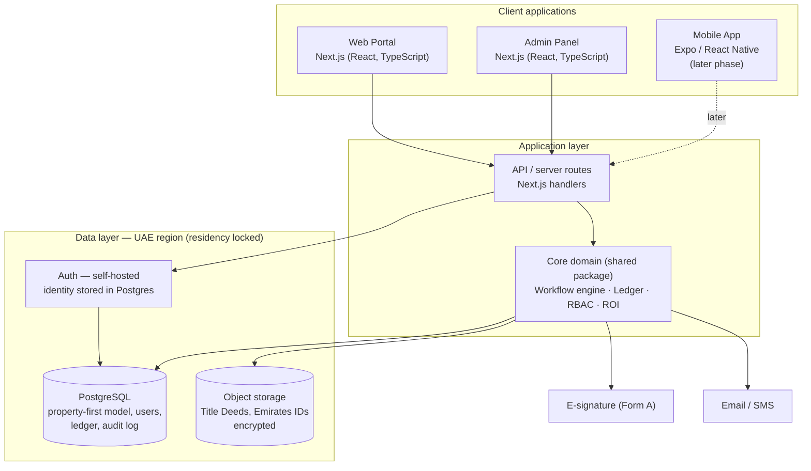

# C4 Level 2 — Containers

The apps, the application layer (thin API + shared core), and the data layer. Region is set by the UAE residency decision.

```mermaid
flowchart TB
    subgraph clients["Client applications"]
        web["Web Portal<br/>Next.js (React, TypeScript)"]
        admin["Admin Panel<br/>Next.js (React, TypeScript)"]
        mobile["Mobile App<br/>Expo / React Native<br/>(later phase)"]
    end

    subgraph appl["Application layer"]
        api["API / server routes<br/>Next.js handlers"]
        core["Core domain (shared package)<br/>Workflow engine · Ledger · RBAC · ROI"]
    end

    subgraph datal["Data layer — UAE region (residency locked)"]
        db[("PostgreSQL<br/>property-first model, users,<br/>ledger, audit log")]
        store[("Object storage<br/>Title Deeds, Emirates IDs<br/>encrypted")]
        authsvc["Auth — self-hosted<br/>identity stored in Postgres"]
    end

    esign["E-signature (Form A)"]
    notify["Email / SMS"]

    web --> api
    admin --> api
    mobile -.->|later| api
    api --> core
    api --> authsvc
    authsvc --> db
    core --> db
    core --> store
    core --> esign
    core --> notify
```
