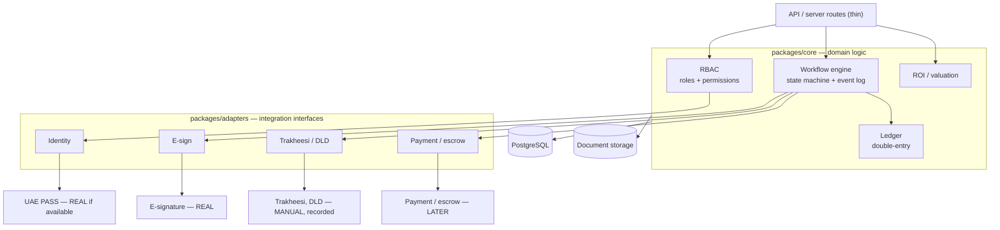

# C4 Level 3 — Core domain & adapters

Inside packages/core and packages/adapters. The workflow engine is the only thing that reaches outward, always through an adapter. REAL / MANUAL / LATER is the integration status.

