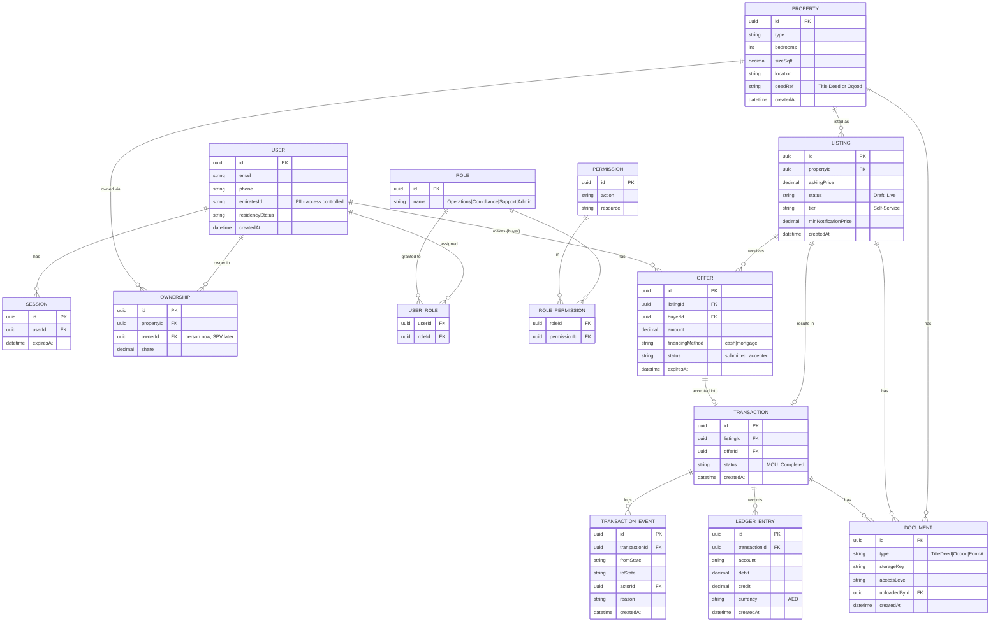

# Data model — ERD

Property-first model. Ownership is a relationship (N owners; person now, SPV later). Append-only TRANSACTION_EVENT and double-entry LEDGER_ENTRY are there from day one. DOCUMENT attaches to a property, listing, or transaction (nullable FKs in practice).

