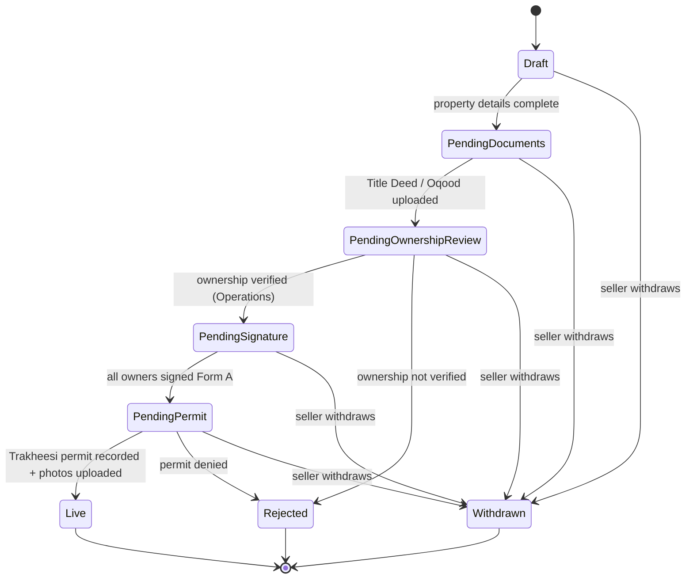

# Listing state machine (MKZ-H-001)

The first feature on the workflow engine. The guard that matters: PendingSignature to PendingPermit needs ALL owners signed.

```mermaid
stateDiagram-v2
    [*] --> Draft
    Draft --> PendingDocuments: property details complete
    PendingDocuments --> PendingOwnershipReview: Title Deed / Oqood uploaded
    PendingOwnershipReview --> PendingSignature: ownership verified (Operations)
    PendingOwnershipReview --> Rejected: ownership not verified
    PendingSignature --> PendingPermit: all owners signed Form A
    PendingPermit --> Live: Trakheesi permit recorded + photos uploaded
    PendingPermit --> Rejected: permit denied
    Draft --> Withdrawn: seller withdraws
    PendingDocuments --> Withdrawn: seller withdraws
    PendingOwnershipReview --> Withdrawn: seller withdraws
    PendingSignature --> Withdrawn: seller withdraws
    PendingPermit --> Withdrawn: seller withdraws
    Rejected --> [*]
    Withdrawn --> [*]
    Live --> [*]
```
