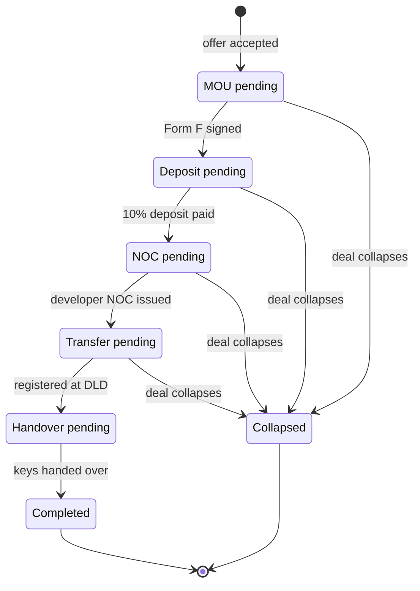

# Transaction state machine

The pizza tracker. Same workflow engine as the listing machine. Licensed steps (NOC, DLD transfer) are recorded manually for the pilot.

```mermaid
stateDiagram-v2
    direction TB
    state "MOU pending" as mou
    state "Deposit pending" as dep
    state "NOC pending" as noc
    state "Transfer pending" as xfer
    state "Handover pending" as hand
    state "Completed" as done
    state "Collapsed" as fail

    [*] --> mou: offer accepted
    mou --> dep: Form F signed
    dep --> noc: 10% deposit paid
    noc --> xfer: developer NOC issued
    xfer --> hand: registered at DLD
    hand --> done: keys handed over
    done --> [*]

    mou --> fail: deal collapses
    dep --> fail: deal collapses
    noc --> fail: deal collapses
    xfer --> fail: deal collapses
    fail --> [*]
```
