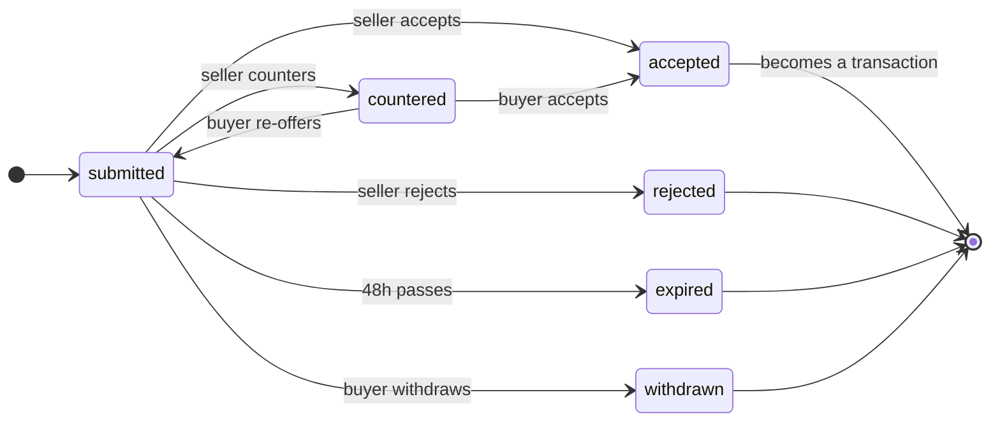

# Offer state machine

Offer states feeding the transaction. Accepted offers become a transaction atomically (see sequence 09).

```mermaid
stateDiagram-v2
    direction LR
    [*] --> submitted
    submitted --> countered: seller counters
    countered --> submitted: buyer re-offers
    submitted --> accepted: seller accepts
    countered --> accepted: buyer accepts
    submitted --> rejected: seller rejects
    submitted --> expired: 48h passes
    submitted --> withdrawn: buyer withdraws
    accepted --> [*]: becomes a transaction
    rejected --> [*]
    expired --> [*]
    withdrawn --> [*]
```
