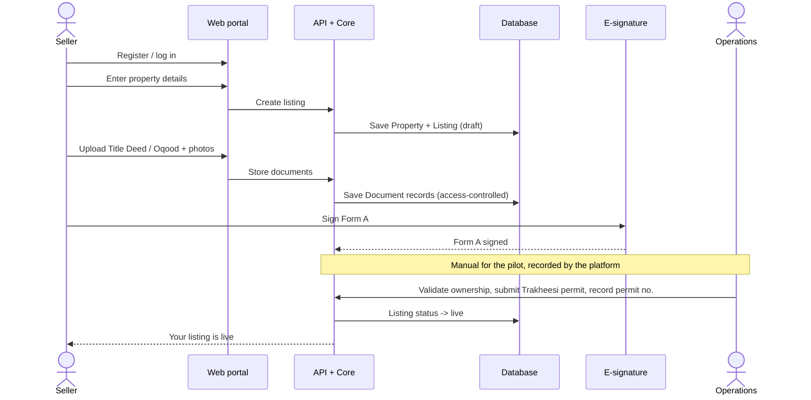

# Sequence — Seller lists a property

End to end listing creation. Ownership verification and Trakheesi are manual Operations steps for the pilot.

```mermaid
sequenceDiagram
    actor Seller
    participant Web as Web portal
    participant API as API + Core
    participant DB as Database
    participant Esign as E-signature
    actor Ops as Operations

    Seller->>Web: Register / log in
    Seller->>Web: Enter property details
    Web->>API: Create listing
    API->>DB: Save Property + Listing (draft)
    Seller->>Web: Upload Title Deed / Oqood + photos
    Web->>API: Store documents
    API->>DB: Save Document records (access-controlled)
    Seller->>Esign: Sign Form A
    Esign-->>API: Form A signed
    Note over API,Ops: Manual for the pilot, recorded by the platform
    Ops->>API: Validate ownership, submit Trakheesi permit, record permit no.
    API->>DB: Listing status -> live
    API-->>Seller: Your listing is live
```
