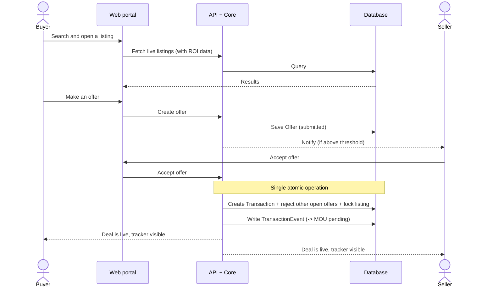

# Sequence — Buyer offer to transaction

Search, offer, and the atomic acceptance that creates a transaction, rejects other open offers, and locks the listing in one operation.

```mermaid
sequenceDiagram
    actor Buyer
    participant Web as Web portal
    participant API as API + Core
    participant DB as Database
    actor Seller

    Buyer->>Web: Search and open a listing
    Web->>API: Fetch live listings (with ROI data)
    API->>DB: Query
    DB-->>Web: Results
    Buyer->>Web: Make an offer
    Web->>API: Create offer
    API->>DB: Save Offer (submitted)
    API-->>Seller: Notify (if above threshold)
    Seller->>Web: Accept offer
    Web->>API: Accept offer
    Note over API,DB: Single atomic operation
    API->>DB: Create Transaction + reject other open offers + lock listing
    API->>DB: Write TransactionEvent (-> MOU pending)
    API-->>Buyer: Deal is live, tracker visible
    API-->>Seller: Deal is live, tracker visible
```
