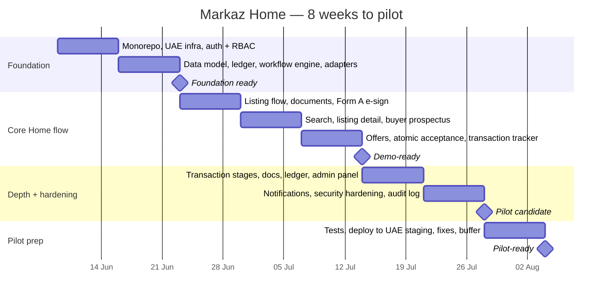

# Build roadmap — 8 weeks to pilot

Foundation first (weeks 1-2), then the Home flow. Milestones at weeks 2, 5, 7, 8.

```mermaid
gantt
    title Markaz Home — 8 weeks to pilot
    dateFormat YYYY-MM-DD
    axisFormat %d %b
    section Foundation
    Monorepo, UAE infra, auth + RBAC               :f1, 2026-06-09, 7d
    Data model, ledger, workflow engine, adapters  :f2, after f1, 7d
    Foundation ready                               :milestone, m1, after f2, 0d
    section Core Home flow
    Listing flow, documents, Form A e-sign         :c1, after f2, 7d
    Search, listing detail, buyer prospectus       :c2, after c1, 7d
    Offers, atomic acceptance, transaction tracker :c3, after c2, 7d
    Demo-ready                                     :milestone, m2, after c3, 0d
    section Depth + hardening
    Transaction stages, docs, ledger, admin panel  :d1, after c3, 7d
    Notifications, security hardening, audit log    :d2, after d1, 7d
    Pilot candidate                                :milestone, m3, after d2, 0d
    section Pilot prep
    Tests, deploy to UAE staging, fixes, buffer    :p1, after d2, 7d
    Pilot-ready                                    :milestone, m4, after p1, 0d
```
