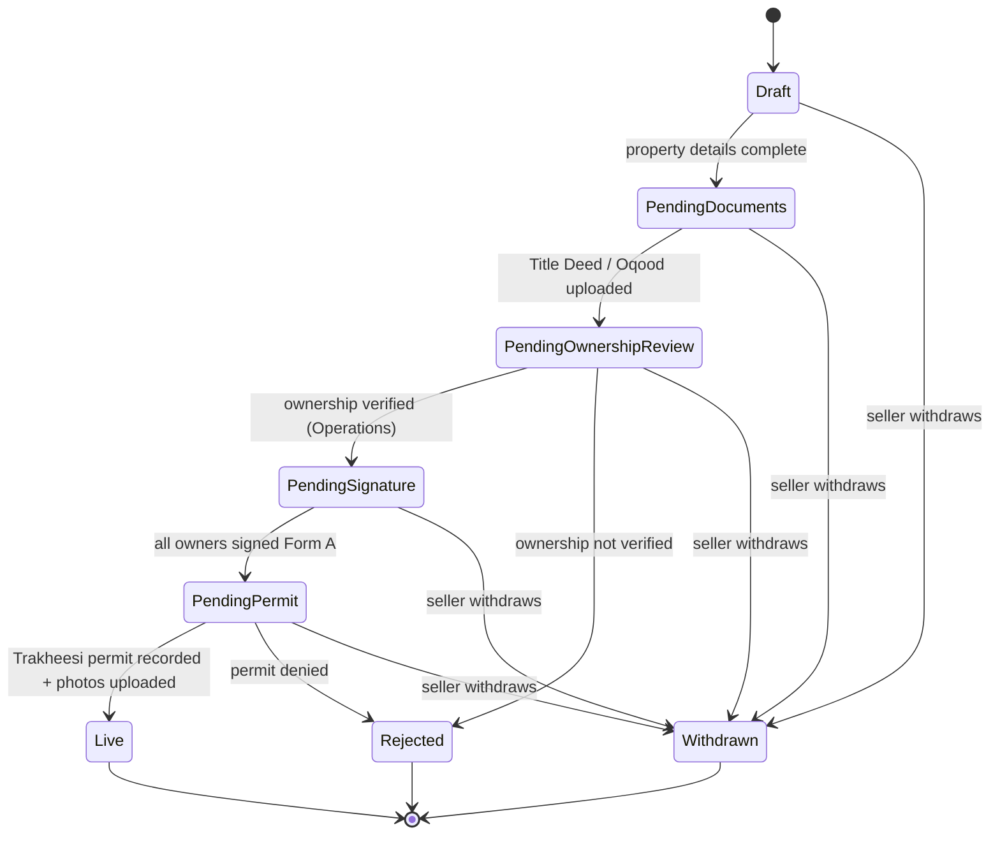

# MKZ-H-001 — Seller Registration & Listing (build spec)

**Epic:** EP-01 Seller Listing Journey · **Persona:** Seller · **Phase:** 1 · **Priority:** Must · **Build week:** 3
**Status:** Not started
**Depends on (foundation must exist first):** auth + RBAC (BL-004), property-first data model + migrations (BL-005), workflow engine + event log (BL-007), adapter interfaces (BL-008), access-controlled object storage (BL-003).

> This is the first feature that runs on the workflow engine and the first to touch three adapters (identity, e-sign, government). Get the listing state machine right here and the transaction tracker (H-005) reuses the same engine.

---

## 1. The story

> As a Seller, I want to register and list my property on Markaz, so that I can reach qualified buyers without paying a seller commission.

The seller creates an account, adds a property, uploads proof of ownership, signs Form A, and the listing goes live once ownership is verified and the Trakheesi permit is recorded.

---

## 2. Round 1 decisions that reshape the workshop draft

The workshop wrote 13 happy-path steps assuming Premium agents, automated ownership validation, and automated photography/permit booking. None of that holds for the pilot. The locked decisions that change this story:

| Decision | Effect on H-001 |
|---|---|
| Buyer pays the 1% commission; no seller fee | The "without paying a seller commission" promise is real and needs no fee logic here. |
| Premium Managed is deferred | **Self-Service is the only tier.** No tier choice, no Premium Agent assignment (workshop steps 6–7 drop out). |
| Form A e-sign is a real integration | Real e-sign adapter; must support **multiple signers** (joint ownership) and be **stage-gated** (no go-live until all sign). |
| Trakheesi + ownership checks are manual/recorded | "System validates ownership" and "submit Trakheesi" become **Operations actions** behind the government adapter (manual impl), not automated API calls. |
| Multi-property sellers | One seller → many properties. The account is not one-property-shaped. |
| Joint ownership = multi-signer, stage-gated | Ownership is a relationship with N owners; **every owner signs Form A** before go-live. |
| UAE residents only (pilot); Emirates ID required | Registration is gated to UAE residents; non-resident path is built later behind the same identity seam. |
| Record-don't-hold money | Nothing in H-001 moves money, so no impact, but the listing carries no payment step. |
| English only | No Arabic/RTL now; leave the i18n seam. |

---

## 3. Pilot scope

**In scope:** seller registration with Emirates ID, multi-property account, create/manage a Self-Service listing, upload Title Deed/Oqood, Operations ownership verification, Form A generation + multi-signer e-signature, Operations recording of the Trakheesi permit, photo upload, go-live, and public visibility of live listings only.

**Trimmed or deferred for the pilot:** Premium tier and agent assignment (deferred with Premium); automated ownership/DLD lookup (manual); automated photography booking (Operations coordinates, photos uploaded manually — confirm in Round 2); the Minimum Notification Price belongs to offer handling (H-003) and is only captured here if we decide to (Round 2).

---

## 4. Re-specified flow (pilot)

1. Seller clicks **List Your Property** → prompted to register.
2. **Register** with email, phone, and Emirates ID; UAE-residency gate. Identity goes through the identity adapter (UAE PASS if available, else capture + Operations review — Round 2).
3. Seller **creates a property** (type, bedrooms, size, location, asking price) → listing in **Draft**. Multi-property: this is one of possibly many.
4. Seller **uploads Title Deed (ready) or Oqood (off-plan)** to access-controlled storage → **Pending ownership review**.
5. **Operations verifies ownership** against the document (manual, government adapter). Approve → **Pending signature**. Reject (mismatch/invalid) → **Rejected** with reason; seller notified.
6. System **generates Form A**; **all owners sign** via the e-sign adapter. Listing is **stage-gated** at **Pending signature** until every signer completes.
7. **Operations records the Trakheesi permit** (manual) and **uploads the photos** → **Pending permit** clears.
8. With permit recorded + photos present, the listing transitions to **Live** and becomes publicly visible.

The seller may **withdraw** at any pre-live stage. A rejected or denied listing is terminal (seller can start a fresh listing).

---

## 5. Listing state machine (first use of the workflow engine)

Rules to encode in the engine: each transition has a guard (e.g. `PendingSignature → PendingPermit` requires *all* owners' signatures present), every transition writes an append-only event (who, when, from→to, reason), and the config is data, not hard-coded `if` branches, so H-005's transaction machine reuses the same engine. `Live` later transitions to `Under offer` / `Sold` — that belongs to the offer and transaction stories (H-003, H-005), out of scope here.

---

## 6. Sub-stories (the buildable pieces)

| Sub-story | What it covers | Backlog | Primary actor |
|---|---|---|---|
| H-001a Registration & identity | Account + Emirates ID via identity adapter; UAE-resident gate | BL-010 | User |
| H-001b Create & manage property/listing | Multi-property; listing fields; Draft state | BL-011 | User |
| H-001c Document upload | Title Deed/Oqood → access-controlled storage | BL-012 | User |
| H-001d Ownership verification | Operations approve/reject via government adapter | BL-014 | Operations |
| H-001e Form A multi-signer e-sign | Generate Form A; all owners sign; stage-gate | BL-013 | User (owners) |
| H-001f Permit + photos | Operations record Trakheesi; upload photos | BL-014 | Operations |
| H-001g Go-live + public visibility | Transition to Live; public sees only Live | BL-011 | System |

---

## 7. Acceptance criteria (expanded)

**H-001a Registration & identity**
- GIVEN a UAE resident WHEN they register with email, phone, and Emirates ID THEN an account is created and identity verification is initiated through the identity adapter.
- GIVEN identity verification succeeds WHEN it returns THEN the account is marked verified and the seller can create properties.
- GIVEN a non-resident attempts to register WHEN residency is required THEN registration is blocked with a clear message (the non-resident path is post-pilot).
- GIVEN identity verification fails or is inconclusive WHEN it returns THEN the account is held for manual review and cannot list yet.

**H-001b Create & manage property/listing**
- GIVEN a verified seller WHEN they add a property (type, beds, size, location, asking price) THEN a property and a listing in `Draft` are created.
- GIVEN a seller who already has a property WHEN they add another THEN both exist independently under one account.
- GIVEN required listing fields are incomplete WHEN the seller tries to advance THEN advancement is blocked with field-level errors.

**H-001c Document upload**
- GIVEN a `Draft` listing WHEN the seller uploads a valid Title Deed or Oqood THEN the document is stored access-controlled and the listing moves to `Pending ownership review`.
- GIVEN an unsupported, oversized, or failed-scan file WHEN uploaded THEN it is rejected with a reason and no state change occurs.

**H-001d Ownership verification**
- GIVEN a listing in `Pending ownership review` WHEN Operations confirms the document matches the seller THEN the listing moves to `Pending signature` and Form A is generated.
- GIVEN ownership cannot be confirmed (name mismatch, invalid document) WHEN Operations rejects THEN the listing moves to `Rejected` with a reason and the seller is notified.

**H-001e Form A multi-signer e-sign**
- GIVEN a single-owner listing WHEN the owner signs Form A THEN the listing moves to `Pending permit`.
- GIVEN a jointly-owned listing WHEN only some owners have signed THEN the listing stays `Pending signature` and unsigned owners are reminded.
- GIVEN a jointly-owned listing WHEN the last owner signs THEN the listing moves to `Pending permit`.

**H-001f Permit + photos**
- GIVEN a listing in `Pending permit` WHEN Operations records an approved Trakheesi permit and photos are uploaded THEN the listing transitions to `Live`.
- GIVEN the Trakheesi permit is denied WHEN Operations records the denial THEN the listing moves to `Rejected` with a reason.

**H-001g Go-live + visibility**
- GIVEN a `Live` listing WHEN a buyer or the public searches THEN the listing is visible with its photos and Investment Case (per H-002).
- GIVEN any non-`Live` listing WHEN a buyer or the public searches THEN it is not visible.
- GIVEN any listing WHEN a buyer views it THEN the Title Deed, Oqood, and Emirates ID are never exposed.

---

## 8. Edge cases and error states

- **Non-resident** registration → blocked (post-pilot path behind the identity seam).
- **Identity verification fails** → account held for manual review; no listing.
- **Bad document upload** (type/size/malware) → rejected, no state change.
- **Off-plan vs ready** → Oqood vs Title Deed both accepted; the document type is recorded.
- **Ownership rejected** → `Rejected` with reason; seller may start a fresh listing.
- **Joint owner never signs** → stays `Pending signature`; reminders; consider a signature-expiry window (Round 2).
- **Trakheesi denied** → `Rejected` with reason.
- **Duplicate property** (same Title Deed/Oqood already listed and live) → detect on the property identity and block or flag for Operations.
- **Edit after live** → minor edits allowed; whether a price change or material edit needs anything re-done is a Round 2 question.
- **Withdraw** → allowed at any pre-live stage; terminal `Withdrawn`.

---

## 9. Data model touchpoints

| Entity | Role in H-001 | Notes |
|---|---|---|
| User / Identity | The seller; Emirates ID, residency status, contact | Identity is reusable and separate from role (design rule 5). |
| Property | The asset (type, beds, size, location, deed/oqood ref) | Property-first (design rule 1); duplicate detection keys off this. |
| Ownership | Relationship: one or more owners ↔ a property | Owner can be a person now, an entity (SPV) later (design rule 2); drives multi-signer. |
| Listing | The sale instance (asking price, status, photos, tier=Self-Service) | Carries the state machine; distinct from the property. |
| Document | Title Deed / Oqood / Form A (type, access control) | Access-controlled; never exposed to buyers. |
| Listing event | Append-only state-change history | Design rule 3; one log the engine writes to. |

No ledger entries are created in H-001 — the ledger starts at the transaction/commission stage (H-005/H-007).

---

## 10. Adapters touched

| Adapter | Use in H-001 | Pilot implementation |
|---|---|---|
| Identity | Emirates ID verification at registration | UAE PASS if available, else capture + Operations review (Round 2) |
| E-sign | Generate + sign Form A, multi-signer | Real |
| Government | Ownership verification + Trakheesi permit | Manual, recorded by Operations |

Each sits behind its interface so the manual ones swap to real later with no change to the listing flow.

---

## 11. RBAC for this story

| Action | User (own) | Operations | Compliance | Admin |
|---|---|---|---|---|
| Register + Emirates ID | ✓ self | — | — | ✓ |
| Create / manage property & listing | ✓ own | assist | — | ✓ |
| Upload Title Deed / Oqood | ✓ own | ✓ | — | ✓ |
| Sign Form A | ✓ as owner | — | — | — |
| Verify ownership (approve/reject) | — | ✓ | ✓ | ✓ |
| Record Trakheesi permit | — | ✓ | — | ✓ |
| Upload listing photos | — | ✓ | — | ✓ |
| Transition listing to Live | — | ✓ | — | ✓ |
| View sensitive docs (Deed, Emirates ID) | ✓ own uploads | ✓ | ✓ | ✓ |
| View a Live listing | ✓ public | ✓ | ✓ | ✓ |
| Withdraw listing | ✓ own | assist | — | ✓ |

Both enforcement layers apply: a role guard (can this role do this action type?) and an ownership check (is this the user's own listing?).

---

## 12. Round 2 questions to confirm before/while building

1. **Emirates ID verification** — is UAE PASS access available for the pilot, or do we capture the ID and have Operations verify manually?
2. **Ownership validation** — confirm there is no DLD lookup available, so this is manual Operations verification; what evidence is sufficient?
3. **Photography** — Operations coordinates and uploads for the pilot, or is there a booking integration? Can sellers self-upload interim photos?
4. **Property types in the pilot** — ready (Title Deed) only, or off-plan (Oqood) too? Which categories (apartment/villa/commercial)?
5. **Minimum Notification Price** — capture it here at listing creation, or only in offer settings under H-003?
6. **Required listing fields and media** — what is mandatory for a listing to be valid and go live?
7. **Edits after go-live** — which fields are editable, and does a price/material change trigger anything (re-sign, re-permit)?
8. **Signature expiry** — if a joint owner doesn't sign, is there a time window before the listing lapses?
9. **Listing tier UI** — hide Premium entirely, or show it as "coming soon"?
10. **Property entry** — free-entered by the seller (likely, given no DLD lookup), with Operations validating against the uploaded deed?

---

## 13. Definition of done

- A UAE-resident seller can register with Emirates ID and hold multiple properties.
- A listing can be created in `Draft`, with Title Deed/Oqood uploaded to access-controlled storage.
- Operations can verify ownership and approve or reject with a reason.
- Form A is generated and signed by all owners via the real e-sign adapter; go-live is stage-gated until every signature is in.
- Operations can record the Trakheesi permit and upload photos; the listing transitions to `Live`.
- Every state change is written to the append-only event log by the workflow engine.
- RBAC is enforced (role guard + ownership check) on every action.
- The public and buyers see only `Live` listings and never see sensitive documents.
- The edge cases in section 8 are handled (non-resident blocked, bad upload rejected, ownership/permit rejection paths, withdraw).
- Tests cover the happy path plus the ownership-reject, joint-signature, and permit-deny paths.
